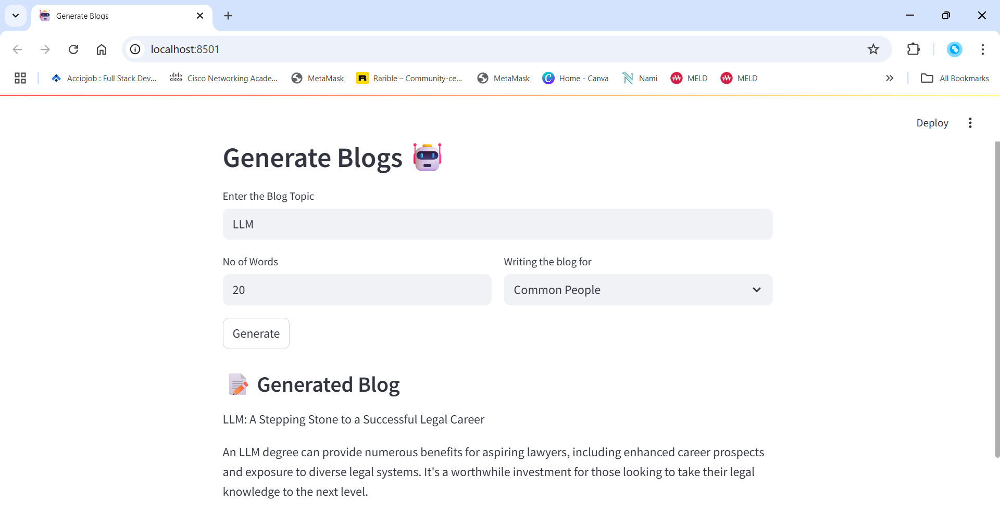

# GenBlogAI

I built `GenBlogAI`, a **Streamlit** web app that generates blog posts using the **Llama 2** language model. 

It lets users enter a topic, choose a writing style (like for researchers or common people), and specify the word count. 

The app then creates a custom blog based on these inputs.

## 💡 Motivation

I built `GenBlogAI` to simplify and speed up the process of writing topic-specific blogs. 

As content creation can be time-consuming, especially when tailoring it to different audiences like researchers or common readers, I wanted to create a tool that automates this using Llama 2. 

This project exists to help students, professionals, and content creators quickly generate high-quality blog drafts with minimal effort.

## 🛠️ Tech Stack

- [Python 3.10+](https://www.python.org/)
- [Streamlit](https://streamlit.io/)
- [LangChain](https://www.langchain.com/)
- [CTransformers](https://github.com/marella/ctransformers)
- [Llama 2 GGML Model](https://huggingface.co/TheBloke/Llama-2-7B-Chat-GGML)

## 🚀 Quick Start

Follow the steps below to set up and run `GenBlogAI` on your local machine:

### 1. Clone the Repository

```bash
git clone git@github.com:MDAAMIRAHMED/InciTagger.git
cd InciTagger
```

### 2. Open the project notebook in Google Colab 
   You can run all steps including data preprocessing, model training, and evaluation directly in Colab.
   
### 3. Upload the dataset (.json file) and base_config.cfg to Colab
Download the dataset from the following link and place it in the project root folder:

📦 [Download Dataset](https://huggingface.co/datasets/MongoDB/accident_reports/blob/main/accidents_reports.json)

### 4. Complete Training & Loading Workflow

```bash
# Step 1: Generate a complete config file from base_config
!python -m spacy init fill-config base_config.cfg config.cfg

# Step 2: Train the model using the filled config
!python -m spacy train config.cfg --output ./output --paths.train ./train.spacy --paths.dev ./dev.spacy

# Step 3: Load the trained model
import spacy
ner_model = spacy.load("output/model-best")

# Step 4: Test the model with a sample input
text = "On March 08, 2024 at 09:01, a Equipment Failure occurred at Factory B in the East region. The incident ID is INC-2024-001."
doc = ner_model(text)

for ent in doc.ents:
    print(ent.text, "->", ent.label_)
```

## 📸 UI Screenshots

### 🔹 Demo Page


## 🤝 Contributing

This project is currently maintained by me. Feel free to open issues or suggest improvements.
